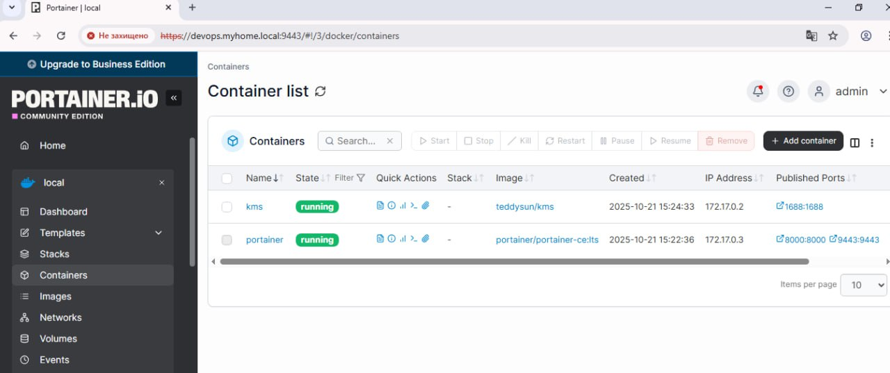
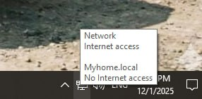
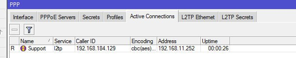
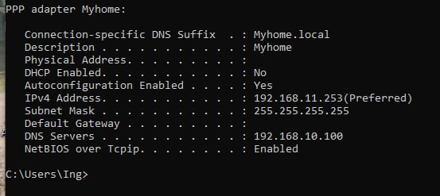
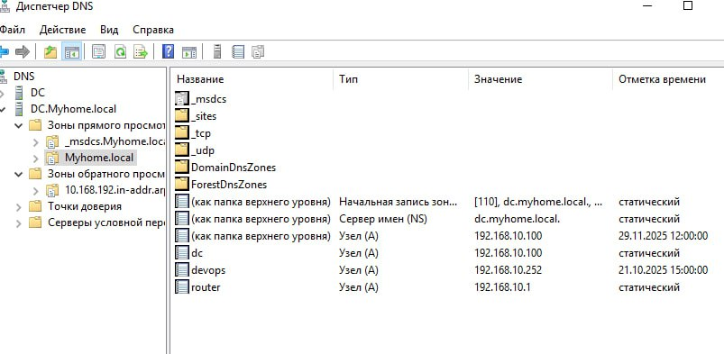
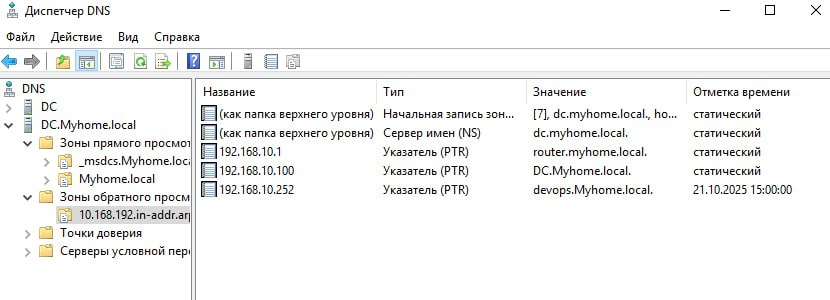
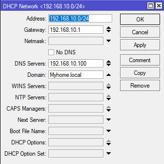

# Myhome_lab
# My Home Lab Infrastructure 🏠

Ласкаво просимо до моєї домашньої лабораторії! Тут я моделюю корпоративну інфраструктуру.

## 🛠 Технології
- **Virtualization:** VMware ESXi, Docker
- **Network:** MikroTik (VLANs, Routing)
- **Servers:** Windows Server 2019 (AD, DNS), Linux

## 📸 Screenshots

### 1. Docker Management (Portainer)
На цьому скріншоті видно мою панель керування контейнерами. Налаштовано локальний домен `devops.myhome.local`.

### 2. Інші налаштування

